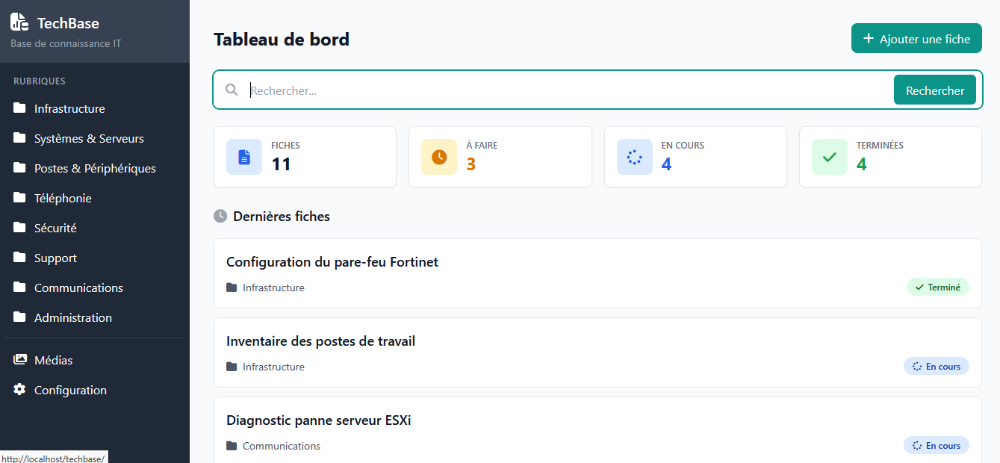

# Techbase

Application de gestion de fiches techniques avec système de tags, rubriques et gestion de médias.



## Fonctionnalités

- **Fiches techniques** : Création, édition et consultation de fiches avec contenu Markdown
- **Système de tags** : Organisation par tags groupés par catégories
- **Rubriques** : Classification hiérarchique des fiches
- **Gestion de médias** : Upload et gestion d'images (JPEG, PNG) et PDF
- **Recherche** : Recherche full-text dans les fiches
- **États** : Suivi de progression (À faire, En cours, Terminé)

## Technologies

- **Backend** : PHP 7.4+
- **Templates** : Twig
- **Base de données** : MySQL/MariaDB
- **Frontend** : Tailwind CSS (CDN), JavaScript vanilla
- **Markdown** : Parsedown

## Installation

1. Cloner le dépôt
```bash
git clone https://github.com/orwelltherazer/techbase.git
cd techbase
```

2. Installer les dépendances Composer
```bash
composer install
```

3. Configurer la base de données
- Créer une base de données MySQL
- Importer le fichier `dump.sql`
- Configurer les paramètres dans `config/database.php`

4. Configuration Apache
- Créer un VirtualHost pointant vers le dossier du projet
- S'assurer que le module `mod_rewrite` est activé

## Structure du projet

```
techbase/
├── config/           # Configuration (database, params)
├── css/              # Styles CSS (minimal, 115 lignes)
├── images/           # Images statiques
├── lib/              # Bibliothèques (Parsedown)
├── templates/        # Templates Twig
│   ├── fiches/       # Templates des fiches
│   └── rubriques/    # Templates des rubriques
├── index.php         # Point d'entrée principal
├── medias.php        # Gestion des médias
└── rubriques.php     # Gestion des rubriques
```

## Interface

L'application utilise Tailwind CSS pour un design moderne et responsive :
- Layout sidebar fixe
- Grille responsive (12 colonnes)
- Breakpoints : sm (640px), md (768px), lg (1024px), xl (1280px), 2xl (1536px)
- Couleur primaire : Teal (#0d9488)

## License

Projet personnel
